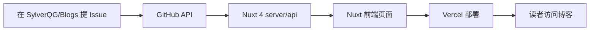

# iBlog - 个人博客项目前期准备

## 1. 项目愿景

基于 GitHub Issues 创建博客内容的个人博客系统。

- **写博客 = 提 Issue**，利用 GitHub 的 Markdown 编辑器、标签管理、协作能力
- 后端负责同步、处理和提供博客数据 API
- 前端负责展示，追求良好的阅读体验和 SEO

### 仓库分工

| 仓库 | 用途 | 示例 |
|------|------|------|
| `SylverQG/Blogs` | **内容仓库** — Issues 作为博客内容源（已有 10 篇博客） | 在此提 Issue = 写博客 |
| `SylverQG/iblog` | **代码仓库** — Nuxt 4 项目源码 | 部署到 Vercel，从 Blogs 仓库读取 Issues |

---

## 2. 技术栈

| 层级 | 技术 | 说明 |
|------|------|------|
| **内容源** | GitHub Issues | 每篇博客对应一个 Issue，Labels 作为分类/标签 |
| **后端 API** | Nuxt 4 server/api (TypeScript) | 与前端同一项目，通过 octokit 调用 GitHub API |
| **前端** | Nuxt 4 (Vue 3) | SSR/SSG 混合渲染，Vercel 一键部署 |
| **包管理器** | pnpm 11.x | 速度快、磁盘省、依赖隔离严格 |
| **数据库** | 暂不使用（视需求可加 SQLite） | 初期直接从 GitHub API 读取，后续可加缓存 |
| **部署** | Vercel（全站单项目部署） | |

---

## 3. 核心流程



### 详细说明

1. **内容创建**：在 `SylverQG/Blogs` 仓库提 Issue，标题 = 博客标题，正文 = 博客内容（Markdown），Labels = 分类/标签
2. **内容获取**：Nuxt 服务端 API 通过 octokit 调用 GitHub REST API，从 `SylverQG/Blogs` 获取 Issues 数据
3. **内容展示**：前端页面从自身 server/api 获取数据（同项目，无需跨域），渲染为服务端渲染页面
4. **自动部署**：推送 `iblog` 代码仓库时，Vercel 自动构建部署；内容更新可配置 Webhook 触发

---

## 4. 项目结构（初步规划）

```
iblog/
├── .github/
│   ├── ISSUE_TEMPLATE/        # Issue 模板（方便写博客）
│   │   └── blog.md
│   └── workflows/             # GitHub Actions 自动化（可选）
│
├── server/                    # Nuxt 服务端 API（替代独立后端）
│   ├── api/
│   │   ├── posts.get.ts      # GET /api/posts — 文章列表
│   │   ├── posts/[id].get.ts # GET /api/posts/[id] — 文章详情
│   │   ├── tags.get.ts       # GET /api/tags — 标签列表
│   │   └── webhook.post.ts   # POST /api/webhook — Webhook 接收
│   ├── utils/
│   │   └── github.ts         # GitHub API 调用封装（octokit）
│   └── types/
│       └── blog.ts           # TypeScript 类型定义
│
├── pages/                     # 页面
│   ├── index.vue             # 首页 — 文章列表
│   ├── posts/
│   │   └── [id].vue          # 文章详情页
│   ├── tags/
│   │   ├── index.vue         # 所有标签
│   │   └── [tag].vue         # 按标签筛选
│   └── about.vue             # 关于页
│
├── components/                # 可复用组件
│   ├── PostCard.vue
│   ├── TagBadge.vue
│   └── AppHeader.vue
│
├── composables/               # 组合式函数
│   └── usePosts.ts
│
├── app.vue
├── nuxt.config.ts
├── package.json
├── tsconfig.json
└── .env.example              # 环境变量示例
```

---

## 5. GitHub 仓库 & Issues 规划

### 两个仓库

| 仓库 | 可见性 | 作用 |
|------|--------|------|
| `SylverQG/iblog` | 公开/私有均可 | Nuxt 4 项目代码，部署到 Vercel |
| `SylverQG/Blogs` | **公开**（已存在） | 博客内容源，Issues 即博客 |

### Blogs 仓库：Issue 作为博客的约定

> 该仓库已有 10 篇博客，Labels 已作为分类使用（如 `Python`、`LLM`、`Crypto` 等）

| 字段 | 用途 | 示例 |
|------|------|------|
| **Title** | 博客标题 | 《Web Development》 |
| **Body** | 博客正文（Markdown） | 包含标题、正文、代码块等 |
| **Labels** | 分类/标签 | `Python`, `LLM`, `Crypto` |
| **State (open)** | 已发布/草稿 | open = 已发布，closed = 草稿 |
| **Created at** | 发布日期 | 2025-10-21 |

### Issue 模板示例（.github/ISSUE_TEMPLATE/blog.md）

```markdown
---
name: 写新博客
about: 使用此模板创建一篇新博客
title: ""
labels: ""
assignees: ""
---

## 摘要

<!-- 博客的简短描述，会显示在列表页 -->

## 正文

<!-- 在这里用 Markdown 写博客内容 -->

---

> 提示：添加 Labels 作为分类，close issue 表示下架博客。
```

---

## 6. API 设计（Nuxt 4 server/api）

利用 Nuxt 4 的 `server/api/` 目录，文件路径自动映射为 API 路由：

| 文件路径 | HTTP | 说明 |
|------|------|------|
| `server/api/posts.get.ts` | `GET /api/posts` | 获取文章列表（支持分页、按标签筛选） |
| `server/api/posts/[id].get.ts` | `GET /api/posts/[id]` | 获取单篇文章详情 |
| `server/api/tags.get.ts` | `GET /api/tags` | 获取所有标签及文章数 |
| `server/api/webhook.post.ts` | `POST /api/webhook` | GitHub Webhook，Issue 变更时触发更新 |

### 关键依赖（初版）
| 包 | 版本 | 用途 |
|---|------|------|
| `nuxt` | ^4.4.8 | 应用框架 |
| `octokit` | 最新 | GitHub API 官方 SDK（TypeScript 原生支持） |
| `tailwindcss` | ^4.3.1 | 原子化 CSS 框架 |
| `@tailwindcss/vite` | 最新 | Tailwind v4 的 Vite 插件（Nuxt 原生兼容） |
| `marked` 或 `@nuxtjs/mdc` | 最新 | Markdown 渲染 |
| `@nuxtjs/color-mode` | 最新 | 暗色模式（可选） |

> **Tailwind v4 注意**：v4 采用 CSS-first 配置，不再需要 `tailwind.config.js`。在 `nuxt.config.ts` 中添加 `@tailwindcss/vite` 插件后，直接在 CSS 中通过 `@import "tailwindcss"` 使用。

---

## 7. 前端页面规划（Nuxt 4）

| 页面 | 路由 | 说明 |
|------|------|------|
| 首页 | `/` | 文章列表，按时间倒序 |
| 文章详情 | `/posts/[id]` | 渲染 Markdown 内容 |
| 标签页 | `/tags` | 展示所有标签 |
| 标签筛选 | `/tags/[tag]` | 按标签筛选文章列表 |
| 关于 | `/about` | 个人介绍页 |

---

## 8. 部署方案

### 全站 → Vercel（单项目部署）

```
iblog 代码仓库（包含页面 + server/api）
        ↓
   Vercel 自动部署
        ↓
  https://iblog.vercel.app
```

- 连接 `SylverQG/iblog` 仓库，Vercel 自动检测 Nuxt 4 项目
- 配置 `nuxt.config.ts` 的 `nitro: { preset: 'vercel' }`
- 在 Vercel Dashboard 设置环境变量：

| 变量 | 值 | 说明 |
|------|-----|------|
| `GITHUB_TOKEN` | 你的 Personal Access Token | 访问 GitHub API |
| `GITHUB_OWNER` | `SylverQG` | 内容仓库的 owner |
| `GITHUB_REPO` | `Blogs` | 内容仓库名 |
| `SITE_URL` | `https://iblog.vercel.app` | 站点地址 |

- 每次推送 `main` 分支，Vercel 自动重新构建和部署
- **无需维护独立后端**，API 和页面在同一部署单元

---

## 9. 前期准备清单

### 9.1 账号 & 工具
- [ ] 注册/登录 GitHub 账号
- [ ] 注册/登录 Vercel 账号（建议用 GitHub OAuth 登录）
- [ ] 本地安装 Git
- [ ] 本地安装 Node.js 24.x LTS 及 pnpm（推荐） / npm
- [ ] 本地安装 VS Code（可选，推荐）

### 9.2 GitHub 准备工作
- [ ] 确认 `SylverQG/Blogs` 是公开仓库，Issues 已启用 ✅（已有 10 篇博客）
- [ ] 创建 `SylverQG/iblog` 代码仓库
- [ ] 生成 GitHub Personal Access Token（用于 Nuxt 4 server/api 调用 GitHub API）
  - 权限：`repo` (public repo) / `issues:read`
- [ ] 可选：在 `SylverQG/Blogs` 配置 Issue 模板

### 9.3 本地开发环境
- [ ] `pnpm dlx nuxi@latest init .` 初始化项目
- [ ] 安装依赖：`nuxt`, `octokit`, `tailwindcss`, `@tailwindcss/vite`, `marked` 等
- [ ] 配置 `nuxt.config.ts`：添加 `@tailwindcss/vite` 插件
- [ ] 配置开发/生产环境变量（`.env`）

### 9.4 第一批博客准备
- [ ] 写一篇「博客搭建记」作为第一篇 Issue（记录项目搭建过程）
- [ ] 写 2-3 篇示例内容用于开发调试

---

## 10. 迭代路线图（建议）

| 阶段 | 内容 | 目标 |
|------|------|------|
| **Phase 1** | 项目初始化，搭建基础框架 | 本地能跑通前后端联调 |
| **Phase 2** | 后端 GitHub API 集成 | 能从仓库 Issues 读取内容 |
| **Phase 3** | 前端展示博客列表 + 详情 | 基本的博客浏览体验 |
| **Phase 4** | 标签系统、分类导航 | 内容组织完整 |
| **Phase 5** | Vercel 部署上线 | 公网可访问 |
| **Phase 6** | Webhook 自动同步、Giscus 评论等 | 自动化体验 |
| **Phase 7** | SEO 优化、RSS、暗色模式等 | 功能完善 |

---

## 11. 参考资源

- [GitHub Issues REST API](https://docs.github.com/en/rest/issues)
- [octokit.js (GitHub 官方 SDK)](https://github.com/octokit/octokit.js)
- [Nuxt 4 官方文档](https://nuxt.com/docs)
- [Nuxt 4 server/api 文档](https://nuxt.com/docs/guide/directory-structure/server)
- [Vercel + Nuxt 部署指南](https://nuxt.com/deploy/vercel)
- [Tailwind CSS v4 文档](https://tailwindcss.com/docs)
- [pnpm 官方文档](https://pnpm.io/)
